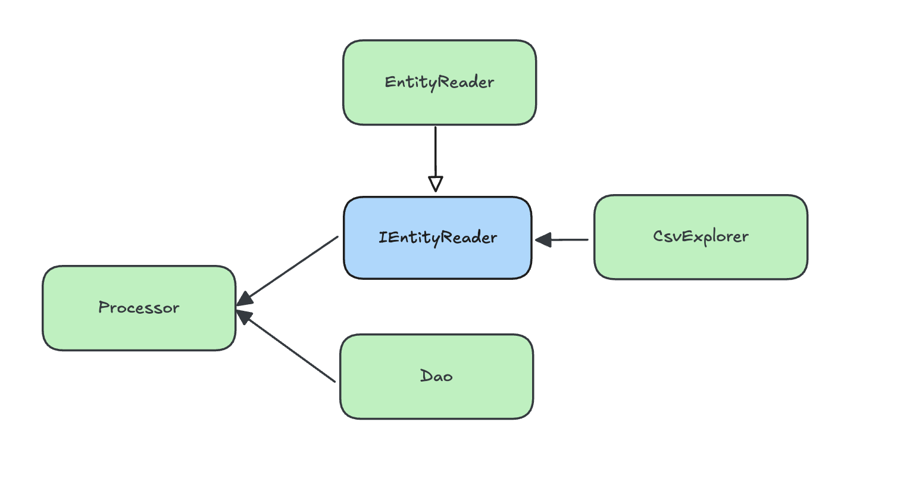

## 소개
현재 영업중인 병원과 약국을 알 수 있는 API 서버입니다.
구현을 위해 공공데이터에서 제공하는 데이터를 클렌징, 필터링하는 C# 프로그램도 개발하였습니다.

## 실행해보기
개발한 ASP.NET 서버와 데이터가 저장된 mssql을 이미지로 만들어 Docker Hub에 Push하였습니다.
docker-compose.yml 파일을 다운받아서 실행하면 http://localhost/swagger/index.html 에서 API를 테스트해 볼 수 있습니다.

## 개발 과정
### 데이터 수집 및 전처리
데이터를 수집하기 위해 [보건의료빅데이터개방시스템](https://opendata.hira.or.kr/op/opc/selectOpenData.do?sno=11925&publDataTpCd=&searchCnd=ttl&searchWrd=전국&pageIndex=1)과
[서울열린데이터광장](https://data.seoul.go.kr/dataList/OA-20337/S/1/datasetView.do?tab=A)의 병원, 약국 정보 데이터를 csv로 다운받아 활용하였습니다.

이를 위해 해결해야하는 문제는 두가지였습니다.
1. 서로 다른 곳에서 제공하는 같은 시설에 대한 데이터를 하나의 데이터로 합쳐야 한다.
    - 아래 예시를 보면 데이터 제공처에따라 서로 다른 Key값을 사용하고 있습니다.
    - 주소나 좌표도 대부분 문자열이 완벽하게 일치하지 않습니다.

| 암호화요양기호    | 요양기관명 | 주소                                     | 좌표(X) | 좌표(Y) | 총의사수  | 한방일반의 인원수 |
|------------|------------|----------------------------------------|---------|---------|-------|------------------|
| JDQ4MTg... | 비움채한의원 | ... 테헤란로 322, 한신인터밸리24 B102,103호 (역삼동) | 127.046588 | 37.5032509 | 1     | 1 |
| 기관ID       | 기관명 | 주소                                     | X좌표 | Y좌표 | 월요일시작 | 월요일종료 | 
| B1106303   | 비움채한의원 | ... 테헤란로 322, 한신인터밸리24 B102 (역삼동)      | 127.0465824 | 37.50323558 | 1000  | 1930 |

2. 같은 파일 안에서도 중복된 데이터가 발견된다.
    - 아래 예시를 보면 정확히 동일한 시설임에도 서로 다른 Key를 가지고 중복된 데이터가 있는 것을 확인할 수 있습니다.

| 암호화요양기호  | 요양기관명 | 주소 | 좌표(X) | 좌표(Y) |
|----------|------------|------|---------|---------|
| ..ExIy.. | 경희서울숲한의원 | 서울특별시 성동구 뚝섬로 400, 201, 202호 (성수동2가, 삼부개발빌딩) | 127.0550106 | 37.5385734 |
| ..QxIy.. | 경희서울숲한의원 | 서울특별시 성동구 뚝섬로 400, 201, 202호 (성수동2가, 삼부개발빌딩) | 127.0550106 | 37.5385734 |

이를 해결하기 위해 하나의 데이터를 처리할 때 다음 과정을 거쳤습니다.
1. DB에 기존에 존재하는 유사한 데이터가 있는지 확인한다.
   - key가 존재한다면 key를 기반으로 검색합니다.
   - key가 존재하지 않더라도 이름이 일치하고 좌표계산을 했을 때 거리가 일정 거리 이하인지 확인합니다. 
2. 기존에 존재하는 데이터를 찾으면 찾은 데이터와 기존 데이터를 병합한다.
   - 기존에 존재하는 데이터를 두 개 이상 찾았을 때에는 예외가 발생한다.

하지만 2번 과정에서 예외가 너무 많이 발생하였고, 일치하는 데이터를 검증하는 정확도를 높일 필요성을 느꼈습니다.


### 데이터 검증 정확도 높이기
데이터 검증 정확도를 높이기 위해 모든 데이터를 테이블에 저장하였습니다. 
그리고 쿼리를 활용해 데이터를 분석하고 어떻게 데이터 일치를 검증할지 고민하였습니다.

<details>
  <summary><strong>쿼리</strong></summary>

  ```sql
  WITH InstitutionPairs AS (
      SELECT
          a.Name as Name,
          a.Address as Address1,
          b.Address as Address2,
          a.Location.STDistance(b.Location) as Distance_In_Meters,
          a.Location.STAsText() as point1,
          b.Location.STAsText() as point2,
          a.PhoneNumber as number1,
          b.PhoneNumber as number2,
          ROW_NUMBER() OVER (ORDER BY a.Name, a.Id, b.Id) as RowNum
      FROM Institution a
      JOIN Institution b ON
          a.Name = b.Name AND
          a.Id < b.Id AND
          a.Location.STDistance(b.Location) < 3000 AND
          a.Location.STDistance(b.Location) > 1000
  )
  SELECT
      Name,
      Address1,
      Address2,
      Distance_In_Meters,
      point1,
      point2,
      number1,
      number2
  FROM InstitutionPairs;
  ```
</details>

쿼리의 결과로  좌표상 거리가 굉장히 먼데도 같은 병원으로 판단되는 곳이 있다는 것을 알게되었습니다.

| Name | Address 1 | Address 2 | Distance (m) |
| --- | --- | --- | --- |
| 가이드치과의원 | 서울특별시 서초구 강남대로 27, AT센터 B1-17호 (양재동) | 서울특별시 서초구 강남대로 27, AT센터 B1-17호 (양재동) | 540.58 |
| **청담이든의원** | **서울특별시 강남구 테헤란로 226, 태왕빌딩 1층,2층 (역삼동)** | **서울특별시 강남구 테헤란로 226, 태왕빌딩 1층,2층 (역삼동)** | **1783.79866291064** |
| **청미의원** | **서울특별시 강남구 선릉로 528, 2층 (삼성동)** | **서울특별시 강남구 선릉로 528, 2,3층 (삼성동)** | **1349.8728375080177** |

또한 아래와 같이 이름과 위치, 전화번호가 동일하지만 서로 다른 병원으로 판단되는 데이터도 발견했습니다.

| Name | Address | PhoneNumber |
| --- | --- | --- |
| 비움채한의원 | 서울특별시 강남구 테헤란로 322, 한신인터밸리24 B102,103호 (역삼동) | 02-554-8495 |
| 비움채한의원 | 서울특별시 강남구 선릉로107길 15, 3층 202호 (역삼동) | 02-554-8495 |
| 비움채한의원 | 서울특별시 강남구 도곡로 419, 4층 (대치동, 쇼핑넷빌딩) | 02-554-8495 |

이러한 예외데이터들을 고려하고 정확도를 높이기 위해 다음과 같은 과정을 적용했습니다.
1. 쿼리에서 key가 같거나 (or) 이름이 일치하고 거리가 2000m 이하인 데이터를 찾습니다.
2. 검색된 데이터가 없다면 새로운 데이터로 저장합니다.
3. 검색된 데이터가 있다면 추가 검증을 거칩니다.
   1. key값이 일치하는 경우에는 해당 데이터와 병합합니다.
   2. 주소 문자열이 일치하는지, 일치하지 않는다면 문자열 유사도가 높은지 확인합니다.
4. 추가 검증 후 남은 데이터와 병합하거나 새로 저장합니다.
이러한 검증 방법을 적용하여 위와 같은 예외 데이터도 성공적으로 처리할 수 있는 것을 테스트코드를 작성하여 확인하였습니다.

### 테스트 코드 작성
위 내용을 검증하기 위해 일부 유닛테스트와 주요 기능에 대한 통합 테스트를 작성했습니다.

Processor는 EntityReader로 부터 특정 경로에 있는 csv파일을 읽어 엔티티객체로 변환해서 반환합니다.
csv를 읽는 것은 검증하고자 하는 부분이 아니었기 때문에 Mocking하고 테스트용 DB를 설정하여 Processor와 Dao의 통합 테스트를 진행했습니다.

또한 테스트는 상호간 테스트 결과에 영향을 주면 안됩니다.
TearDown에서 DataClean을 진행하여 테스트 수행 후 DB 상태를 초기화 하였습니다.

### 쿼리 실행계획 분석하기
병원, 의원 데이터의 총 record 개수는 10만 개를 조금 상회합니다.
10만개 정도의 데이터를 처리하고 저장하는데 1시간이 이상이 걸려 이상함을 느꼈습니다.
특히 저장된 record가 늘어날수록 데이터 저장 속도가 급격히 느껴지는 것을 확인하였습니다.
이를 해결하고자 쿼리 실행 계획을 분석하였습니다.

```
Index Seek(OBJECT:([LogApp].[dbo].[Institution].[IX_Code]), 
SEEK:([LogApp].[dbo].[Institution].[Code] IsNotNull),  
WHERE:(CONVERT_IMPLICIT(nvarchar(100),[LogApp].[dbo].[Institution].[Code],0)=[@Code]) ORDERED FORWARD)
```
실행 계획을 분석했을 때, VARCHAR Code 컬럼에 인덱스를 생성해 두었는데, 
인자가 NVARCHAR로 전달되어 명시적 형변환이 일어났습니다. 
형변환이 일어나면서 인덱스를 제대로 활용하지 못하고 있다는 것을 알게되었습니다.

```csharp

//기존 문제의 코드
command.Parameters.AddWithValue("@InstitutionType", institution.InstitutionType.ToString());

//개선 코드
var sqlParameter = command.Parameters.Add("@Code", SqlDbType.VarChar, 100);
sqlParameter.Value = institution.Code ?? (object)DBNull.Value;
```
이러한 문제를 해결하기위해 전달하는 인자의 타입을 명시하였습니다.
이후 인덱스를 정상적으로 활용하여 수행 속도가 10배 이상 빨라진 것을 확인하였습니다.